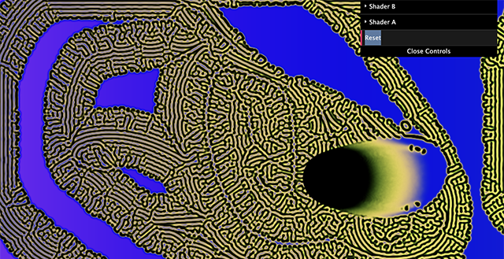

# Reaction Diffusion in WebGL

[Reaction Diffusion](https://en.wikipedia.org/wiki/Reaction%E2%80%93diffusion_system)

## Set-up

Using three shaders to create Two-component reaction–diffusion 
Click and Drag Mouse or just watch the patterns

Main shader reads the data from ShaderB and ShaderB reads from ShaderA and Shader A reads shader B in a loop.

## Shader Controls

- F is the feed rate of A.
- K is the kill rate of B.

Diffusion Coefficients (Da and Db):
These values are constants that determine the rate of diffusion for each chemical species. A higher diffusion coefficient means the substance diffuses faster.
